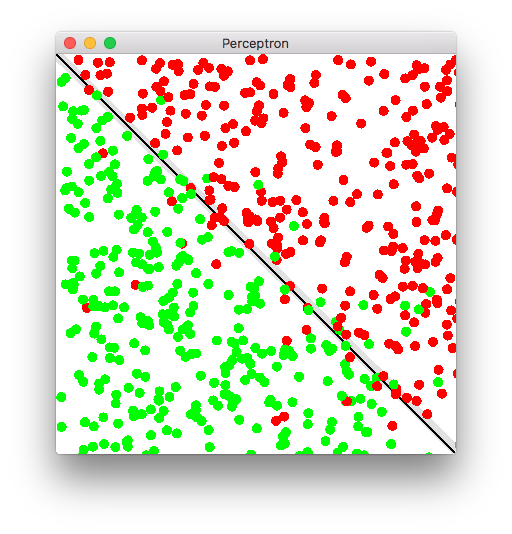

# Perceptron
A perceptron implementation in Rust.
This code is based on the perceptron explained in Daniel Shiffman's [The Nature of Code](http://natureofcode.com/book/chapter-10-neural-networks/).

